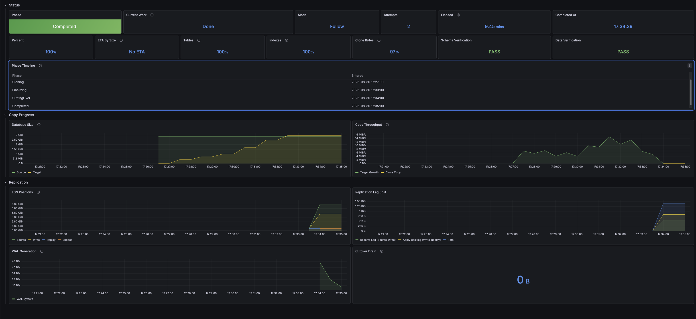

# Monitoring

The operator exports per-Migration Prometheus metrics, and the Helm chart ships the pieces that turn them into something you look at: a ServiceMonitor for the scrape, alert rules as a PrometheusRule, and three Grafana dashboards.
All three are opt-in values; this page is the reference for the metrics and for wiring the chart into a kube-prometheus-stack style setup.

## Scrape setup

The manager serves metrics over HTTPS on :8443 and authenticates every scrape; `metrics.enabled` (default `true`) controls the endpoint and its Service.
With the Prometheus Operator, `metrics.serviceMonitor.enabled=true` is the whole scrape setup; the ServiceMonitor sends Prometheus' own ServiceAccount token.
The scraping ServiceAccount additionally needs `get` on the `/metrics` nonResourceURL; kube-prometheus-stack already grants that to its Prometheus, and the 401/403/500 sections in [Troubleshooting](../troubleshooting.md) map the failure modes.

The ServiceMonitor sets `honorLabels: true`, so the `namespace` and `name` labels on migration metrics stay the Migration's own instead of being renamed to `exported_namespace` by the scrape.
The chart scrapes every 10 seconds, matching the nominal active-worker poll interval.
Gauges change when the controller observes the worker; slower scrapes can miss intermediate samples.
Raise `metrics.serviceMonitor.interval` if that is more traffic than you want, and expect the dashboards to lag by whatever you set.
The other values tune the rest: `metrics.serviceMonitor.additionalLabels` (for a Prometheus that selects monitors by label), `scrapeTimeout`, `relabelings`, and `metricRelabelings`.

## Controller timing

The normal active-worker path requests its next poll 10 seconds from the start of the reconcile pass, without adding another 10 seconds after observation work finishes.
An overrun requests a positive requeue delay; slow operations and controller queueing can still delay the next observation.
Other phase and retry paths keep their own requeue behavior.

The controller emits a sanitized duration summary at verbosity `V(1)` for operations reached during the pass.
The existing manager flag `--zap-log-level=debug` exposes these messages.
The summary records timing, not credentials, SQL, or raw command output.
Use it to investigate slow passes; it does not establish the cause of a historical delay or guarantee a wall-clock polling interval.

## Metric reference

Every `pgcopydb_migration_*` metric is a gauge labeled `namespace` and `name` for the Migration it describes.
A value the operator does not know is absent, never zero: dashboards and alerts MUST treat a missing series as "no data", not as 0.

| Metric | Extra labels | Meaning | Exists |
|---|---|---|---|
| `pgcopydb_migration_phase` | `phase` | 1 for the current phase | always |
| `pgcopydb_migration_attempts` | | Worker Jobs created so far | always |
| `pgcopydb_migration_info` | `mode` | Always 1; mode is `clone` or `follow` | always |
| `pgcopydb_migration_start_time_seconds` | | Unix time the first attempt started | once started |
| `pgcopydb_migration_completion_time_seconds` | | Unix time the migration completed | once completed |
| `pgcopydb_migration_condition_transition_timestamp_seconds` | `type`, `status` | Unix time that condition last changed status, straight from its `lastTransitionTime` | per condition |
| `pgcopydb_migration_verified` | | 1 when every requested compare check passed, 0 if any mismatched | after a verification result |
| `pgcopydb_migration_verification_check` | `check`: `schema` or `data` | 1 when that check passed, 0 on mismatch, -1 when `spec.verification` does not request it | once the spec is read, minus a requested check with no result yet |
| `pgcopydb_migration_source_database_size_bytes` | | Source database size; summed across the instance with `allDatabases` | worker running |
| `pgcopydb_migration_target_database_size_bytes` | | Target database size; summed across the instance with `allDatabases` | worker running |
| `pgcopydb_migration_tables_done` / `_tables_total` | | Tables copied / planned | worker running |
| `pgcopydb_migration_indexes_done` / `_indexes_total` | | Indexes built / planned | worker running |
| `pgcopydb_migration_clone_copied_bytes` / `_clone_planned_bytes` | | Base-copy bytes moved / planned | worker running |
| `pgcopydb_migration_replication_lag_bytes` | | Total replication lag | follow, streaming |
| `pgcopydb_migration_source_lsn_bytes` | | Source WAL head as an absolute byte position | follow, streaming |
| `pgcopydb_migration_write_lsn_bytes` | | The walsender's `write_lsn` on the source, or the slot's `confirmed_flush_lsn` where the stat columns are masked | follow, streaming |
| `pgcopydb_migration_replay_lsn_bytes` | | Source-visible replay feedback, including certified idle progress, as an absolute WAL byte position | follow, streaming |
| `pgcopydb_migration_endpos_lsn_bytes` | | Cutover endpos as an absolute byte position | after cutover set it |
| `pgcopydb_operator_build_info` | `version` | Always 1; operator-wide, no migration labels | always |

The "Exists" column is the contract for when a series is present:

- **always**: from the first reconcile of the Migration until its deletion removes every series.
- **worker running**: the sizes are live samples from the worker pod, so they appear during attempts and fade out with the pod.
- **worker running** for single-database counters too, but they have two sources and the second is more exact.
  While the copy runs, the same psql sample that reads the sizes counts relations on both databases: tables holding rows on the target and its table bytes, against the tables the target was given and their size on the source, and indexes the target has built against the ones the source has.
  A table holding no rows on the source owes nothing and counts as done; one holding rows on the source and none on the target does not, whatever storage its restored schema already occupies.
  This requires psql and GNU `timeout` in the runner and touches no pgcopydb catalog.
  Then pgcopydb's own accounting replaces it wherever it can be read: at clone completion for a plain clone, and out of the verify Job's log after cutover for a follow migration, both only on allowlisted runner versions (see [Troubleshooting](../troubleshooting.md)).
  The estimate leads that accounting slightly, because a table counts once it holds a row, so a table copied in parts counts before its last part lands.
- **follow, streaming**: plain clones never produce these; in follow mode they appear as soon as the replication slot answers, which is during the base copy, before streaming starts.
- **per condition**: one series per condition in `status.conditions`, labeled with the status it changed into.
  A flip retires the old `{type,status}` pair and stamps a new one, so the endpoint never carries more than one series per condition type.
  The retired pair keeps its samples in Prometheus, so query the timeline as `last_over_time(...[$__range])` rather than at the range end: that is what puts both sides of a flip back on the panel, and it is the only way to read a Migration that has since been deleted.

Read the timeline off the condition transitions, not off the phase.
Read completion off the table and index counters: the clone-byte ratio tops out a few percent short of 100, for the reason in the [caveats](#caveats) below.

With `spec.clone.allDatabases: true`, each size gauge sums `pg_database_size(oid)` over its endpoint's databases, excluding only `template0` and `template1`.
The target sum includes existing databases even when they have no counterpart on the source, not just databases created by this Migration.
Table, index, and clone-byte counters are absent in this mode; the operator reads neither per-database relation counts nor the instance catalog's empty counters.

> [!note]
> Size gauges measure physical storage, not bytes transferred by this Migration.
> Growth on unrelated target databases contributes to the all-databases target gauge, and maintenance or recovery can shrink either gauge.
> A slope estimates storage growth, not isolated copy throughput; `rate()` assumes a monotonic counter and is not appropriate for these gauges.

Each size, relation-count, and clone-stage observation runs `SET LOCAL statement_timeout = 5000` and its query in one `psql --single-transaction` invocation with `ON_ERROR_STOP`.
Connection-string options cannot disable that bound.
The transaction keeps the setting and query on the same backend through a transaction pooler, and restores the backend's prior timeout on commit or rollback, including SQL errors and statement cancellation.
The sampler therefore leaves no five-second session timeout for a later COPY or index build to inherit.
This guarantee covers the operator's progress SQL, not pgcopydb's compatibility with transaction pooling for an entire migration.
GNU `timeout` sends TERM after six seconds and KILL one second later, so a stalled connection also releases its remote processes even if the exec stream closes early.
The single-database sample runs two sequential queries, the target's counts and then the source's, with a combined process budget of 14 seconds, below the 30-second exec timeout.
All-databases sampling runs two size queries with a combined process budget of 14 seconds.
A failed side retains its last size gauge while a usable reading updates the other side.
Relation counts need both sides, so a partial poll preserves the prior progress counters.
A failed stage probe preserves the established phase; sampling failures do not complete or fail a migration.
`pgcopydb_migration_phase` is an instantaneous gauge; after the initial `Pending` bootstrap, the phase summarizes the conditions.
A phase shorter than the scrape interval is therefore never sampled: on a follow migration whose `Streaming` condition turned true one second before `CaughtUp` did, Prometheus ended up holding no `Streaming` sample at all, while every longer phase was captured.
A transition timestamp cannot be missed that way, because the value keeps standing for as long as the condition holds, so every scrape carries the same instant the operator stamped when it set the condition.
One case survives: a condition that changes twice inside a scrape interval publishes only the later of the two transitions, since the CR keeps one `lastTransitionTime` per condition and the earlier value is overwritten before anything reads it.

Derived quantities stay in PromQL rather than becoming metrics: receive lag is `source - write`, apply backlog is `write - replay`, WAL generation is `rate(source_lsn_bytes)`, and percent done divides the done gauges by their totals.
Receive lag reads high by one confirmation wherever `write` fell back to the slot's confirmed flush position.
A pass whose source row carried no confirmed position leaves the previous replay and lag standing, so those two read stale for a pass rather than wrong.
Apply backlog reads both operands from the same walsender row, so the ordering that holds there holds here.
Without `pg_read_all_stats` both fall back to the slot's confirmed flush position and the difference reads zero, which means unknown rather than caught up.
The bundled runner, pgcopydb `0.18.15.gea2dc96`, confirms target commits with `synchronous_commit=on` before reporting their replay progress.
It can also [certify genuine primary keepalive positions](https://github.com/ydixken/pgcopydb/blob/ea2dc96a47c2f7676d71a4967d044a1e469e4110/src/bin/pgcopydb/ld_stream.c#L1521-L1546) from the current connection, advancing network feedback across filtered WAL.
That feedback does not move the target replication origin or the sentinel's data replay cursor; see [Follow diagnostics](../design/follow-diagnostics.md) for the conditions.
An advancing replay gauge on an idle publication therefore does not imply new target rows or measure applied-data throughput.
Other supported runner versions differ; see [client tool versions](../reference/prerequisites.md#client-tool-versions).
Receive batching does not make these LSN slopes end-to-end throughput measurements or remove the [drain-verification gate](live-migration.md#manual-cutover-runbook).

## Dashboards

The chart ships three dashboards, linked to each other through their shared `pgcopydb` tag:

- **Migration Detail** (uid `pgcopydb-migration`): one migration end to end.
  Two rows of stats lead: what it is doing and when, then how far along it is and whether each compare check passed.
  Below them two timeline tables side by side, phases as sampled and condition transitions as stamped, then database sizes and copy throughput, LSN positions with the lag split, WAL generation, and the cutover drain.
- **Fleet Overview** (uid `pgcopydb-fleet`): counts by phase, an all-migrations table whose name column links into the detail dashboard, and lag, throughput, and attempt churn per migration.
- **Operator Health** (uid `pgcopydb-operator`): build and leader status, reconcile rate and duration percentiles, workqueue depth and latencies, and process CPU, memory, goroutines, and file descriptors.

All three auto-refresh every 10 seconds, matching the nominal poll and scrape intervals.
Slow controller passes, queueing, and scrape timing can delay a change reaching the screen.
That is a saved default, not a policy: Grafana's own refresh picker overrides it for your session.



### Wiring the chart into Grafana

Two things have to exist first, and the chart provides neither: a Prometheus that scrapes the operator ([Scrape setup](#scrape-setup) above), and a Grafana with that Prometheus as a data source.
With both in place, the chart's side is two values:

```yaml
metrics:
  serviceMonitor:
    enabled: true
grafana:
  dashboards:
    enabled: true
    # The namespace Grafana runs in, not the one the operator runs in.
    namespace: monitoring
    folder: pgcopydb
```

`grafana.dashboards.enabled=true` renders each dashboard as its own ConfigMap, labeled `grafana_dashboard: "1"`.
Grafana's dashboard sidecar (kube-prometheus-stack runs one by default) watches for that label, writes each ConfigMap's data key out as a file, and Grafana loads what appears.
Check they landed where the sidecar is watching:

```sh
kubectl get configmap -n monitoring -l grafana_dashboard=1
```

Two sidecar settings then decide whether the dashboards show up, and where:

- **Namespace.** The sidecar watches only its own namespace unless `sidecar.dashboards.searchNamespace` widens it, so `grafana.dashboards.namespace` has to name the namespace Grafana runs in.
  The chart's release namespace is only the default, and it is rarely the right answer.
- **Folder.** `grafana.dashboards.folder` writes a `grafana_folder` annotation.
  The sidecar acts on it only when its own `folderAnnotation` setting names that annotation and its dashboard provider has `foldersFromFilesStructure` enabled.
  Otherwise the three land in General, which is cosmetic.

> [!warning]
> The sidecar names the file it writes after the ConfigMap's **data key**, not after the ConfigMap.
> A second ConfigMap in that namespace carrying a `migration-detail.json` key therefore overwrites this one, last writer wins, with no error logged anywhere; a hand-imported copy kept around for editing is the usual source of that.
> These are provisioned files rather than Grafana's own dashboards, so Grafana also refuses UI edits over them unless the provider sets `allowUiUpdates: true`, and the next provisioning pass overwrites whatever it did accept: keep changes in the JSON, or "Save as" a copy under its own uid.

### Importing without the sidecar

Import the JSON by hand in Grafana (Dashboards, New, Import).
Render the copies that match the chart you deployed rather than reading them off `main`:

```sh
helm template pgcopydb-operator oci://ghcr.io/ydixken/pgcopydb-operator/charts/pgcopydb-operator \
  --set grafana.dashboards.enabled=true \
  --show-only templates/grafana-dashboards.yaml
```

Each ConfigMap in that output holds one dashboard under a `<name>.json` data key.
Every panel reads its data source from the dashboard's `datasource` variable, so pick your Prometheus there after importing; no panel hardcodes one.

### Reading Migration Detail

Two variables at the top select the migration: namespace, then name.
Both are filled from `pgcopydb_migration_info`, so a Migration is listed from its first reconcile until it is deleted.

The screenshot above is a follow migration shortly after its cutover, with both compare checks enabled.
Reading it:

- **Phase** is the state the operator is in.
  **Current Work** is the activity inside that state, so `Validating` reads as Preflight Checks, `Finalizing` as Vacuum And Index Builds, and `Streaming` as Following WAL.
  The tile reaches Vacuum And Index Builds only after the operator has seen the copy running and then stop, so it does not appear while tables are still being copied.
- **Elapsed** is how long the run took once it completed, and how long it has been going while it has not.
  **Completed At** is where it ended, and reads Still Running until there is an end.
- **Percent** is target size over source size, clamped at 100.
  It is the coarsest of the progress readings: whole databases, WAL and catalog overhead included, where the counters beside it weigh only the tables in scope.
  **ETA By Size** divides the remaining bytes by how fast the target is currently growing, and reads No ETA outside `Cloning`: index builds, the cutover drain, and verification do not move bytes at a rate worth extrapolating from.
- **Tables**, **Indexes** and **Bytes** are six tiles, one per side: a `(Source)` total beside the `(Target)` figure measured against it.
  One number per tile, because Grafana cannot join two query results into one string and two values in one tile leaves them at opposite edges of it.
  They read N/A before the target has a schema to count, and for a migration whose worker never ran.
  Bytes compares table bytes on disk on both sides, so pgcopydb's own wire tally never replaces it: a wire count under an on-disk total would read as a shortfall that is not there.
- **Schema Verification** and **Data Verification** are one tile per compare check.
  Each reads Pending until its Job produces a result, then PASS or FAIL.
  A check `spec.verification` does not request reads Deactivated, which both checks do by default.
  A result outranks the spec, so switching a check off after it reported a mismatch still reads FAIL.
- **Cutover Drain** is the bytes still to replay before the endpos is reached.
  It reads No Endpos until a cutover sets one, and 0 B once source-visible replay feedback reaches it, which is what the screenshot shows.
  Only `CutoverCompleted`, after target-origin or content verification, proves the drain.

Every tile here is scoped to one Migration, so an empty result means that Migration is not in the dashboard's range and the tile reads N/A.
Tiles that report a fact about the run rather than its current state (Attempts, Elapsed, Completed At, the two verification tiles, Cutover Drain) read over the range, so a Migration that has since been deleted keeps what it last reported instead of falling back to N/A.
They read the range end first and give way to a live Migration, because a range wide enough to hold a deleted run is wide enough to hold an earlier run that reused the same name.

## Alerts

`metrics.prometheusRule.enabled=true` installs the alert rules from [`charts/pgcopydb-operator/rules/migrations.yaml`](https://github.com/ydixken/pgcopydb-operator/blob/main/charts/pgcopydb-operator/rules/migrations.yaml) as a PrometheusRule.
If your Prometheus selects rules by label (kube-prometheus-stack does), add the matching label with `metrics.prometheusRule.additionalLabels`.
Thresholds and windows are starting points; the promtool unit tests under `test/alerts/` pin each one, so retune there first.

| Alert | Severity | Fires when |
|---|---|---|
| `PgcopydbMigrationFailed` | critical | The phase is `Failed` for 5m |
| `PgcopydbMigrationVerificationFailed` | critical | A compare mismatch stands for 5m |
| `PgcopydbMigrationRetrying` | warning | Three or more new attempts in 30m while active |
| `PgcopydbMigrationCloneStalled` | warning | Cloning while the target size is flat for 1h |
| `PgcopydbMigrationReplicationLagHigh` | warning | Lag above 64Mi for 10m while `Streaming` or `CutoverPending` |
| `PgcopydbMigrationCutoverStalled` | critical | An endpos is set and not reached for 15m |

Both warnings match a narrow set of phases on purpose.
`PgcopydbMigrationCloneStalled` matches `Cloning` alone, because the index and vacuum tail normally reads as `Finalizing` and leaves the target flat without being stalled.
`PgcopydbMigrationReplicationLagHigh` skips the base copy, where the lag gauge already exists, a large lag is expected, and nothing can act on it.

No alert covers slot retention.
While a follow migration is suspended, failed, or streaming, its replication slot retains WAL on the **source**, and the operator's metrics cannot see the source's disk.
Monitor `pg_replication_slots` on the source itself (`active` and `safe_wal_size`; postgres_exporter exposes both) and alert on inactive slots or a shrinking `safe_wal_size`.

## How this is tested

Every change runs the static gates: the dashboards must parse with unique uids, every PromQL token in a panel or alert must name a registered metric (and every metric must be consumed somewhere), and promtool checks the rules plus a unit test per alert.
Each release candidate then runs a live gate: the e2e suite drives a real follow migration, checks the exported series against a running Prometheus mid-stream and after cutover, replays every dashboard panel query and fails on an empty answer unless the panel is legitimately empty for a completed migration, and finally verifies deletion removes the series.
The active pooling E2E runs the real progress sampler from a candidate runner Job through single-slot source and target PgBouncer transaction pools.
The pools use a dedicated ephemeral CNPG pair because managed authentication can leave objects in `postgres` after Pooler deletion.
The spec checks that both shared maintenance catalogs retain their schema/function signatures and owners during pooling and after fixture cleanup.
It checks backend identity and timeout restoration across successful and lock-cancelled samples, recovery after unlocking, and subsequent COPY and index operations that each take more than five seconds on the server.
Pooler resets and query timeouts do not mask the sampler's behavior.

## Caveats

- The gauges are process state in the manager.
  They disappear on an operator restart and come back as each Migration is reconciled again, which happens at startup; a scrape gap around restarts is normal.
- The database sizes are live samples from the worker pod.
  For a finished migration there is no pod to sample, so those two series do not return after a restart even though the migration's other series do.
- `rate()` and `delta()` over the size gauges misread a shrinking database as a counter reset; the throughput panels note it and the stalled-clone alert uses `delta()` for that reason.
- The tables, indexes and clone byte series move during the base copy, from the psql sample described above, and jump once when pgcopydb's own count replaces it (at clone completion, or at drain verification for a live migration).
  The estimate counts a table once it holds a row, so a table copied in parts counts before its last part lands and the estimate runs slightly ahead.
  The small step at the handover is that correction landing.
  Nothing rounds the estimate up when the worker exits 0.
  A table that is empty on the source owes nothing and counts as done on its own, so a finished copy that still reads one table short is a finding: that table holds rows on the source and none on the target, which is how a `--resume` after killed attempts once called an 848MB table done ([#277](https://github.com/ydixken/pgcopydb-operator/issues/277)).
  The byte figures are not rounded up either: the two sides end a little apart through fillfactor, bloat and alignment, so read a shortfall there against the table count beside it.
  A failed copy keeps its partial figures, which are the ones worth reading there.
- The `by size` percent-done series can read above 100 during `Finalizing`: index builds and pre-vacuum bloat put the target ahead of the source in bytes before space is reclaimed.
  The query clamps it at 100, because a progress bar past 100 is a display bug, not a finding.
- The planned clone bytes come from pgcopydb's table-size statistics.
  The copied/planned ratio stays a few percent short of 100 by construction: a relation's on-disk size carries page and tuple headers, alignment padding and free space that a COPY stream does not move.
- Copy Throughput's target growth is clamped at 0: vacuum reclaims space during `Finalizing`, and the resulting negative slope is real but meaningless as a byte rate.
  Clone copy needs no such clamp: a retry resumes from the same work-dir catalog, and an interrupted table's killed `COPY` leaves no partial bytes credited, so the tally never runs backward.
- On a custom stock 0.18 runner with psql and GNU `timeout`, these series still flow because sampling needs no pgcopydb command; that runner gives up the exact count that would replace the estimate at the end.
- The stalled-clone alert matches `Cloning` alone because the tail normally reads as `Finalizing`, which needs the phase probe to have seen this attempt's copy workers at least once.
  That probe runs on every poll, about every 10 seconds, so only a copy that finishes almost the instant it starts fails to set it and carries `Cloning` into its tail.
  Firing still takes an hour of flat target, which a copy that short does not plausibly produce.
