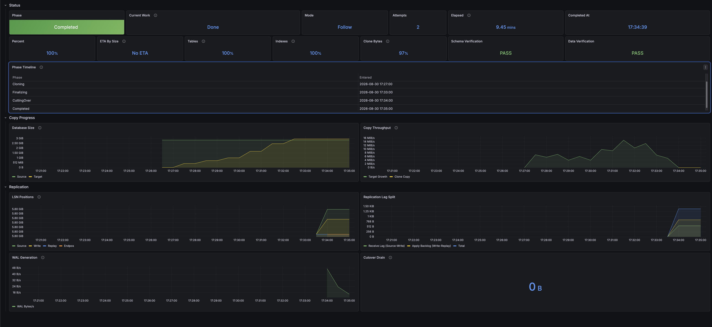

# Monitoring

The operator exports one set of Prometheus metrics per Migration.
The Helm chart ships the parts that consume them, all opt-in: a ServiceMonitor for the scrape, alert rules as a PrometheusRule, and three Grafana dashboards.
This page is the reference for the metrics and for wiring the chart into a kube-prometheus-stack setup.

## Scrape setup

The manager serves metrics over HTTPS on :8443 and authenticates every scrape.
`metrics.enabled` (default `true`) controls the endpoint and its Service.
With the Prometheus Operator, `metrics.serviceMonitor.enabled=true` is the whole scrape setup, and the ServiceMonitor sends Prometheus' own ServiceAccount token.
The ServiceAccount that scrapes also needs `get` on the `/metrics` nonResourceURL.
kube-prometheus-stack already grants that to its Prometheus, and the 401, 403, and 500 sections in [Troubleshooting](../troubleshooting.md) map the failure modes.

The ServiceMonitor sets `honorLabels: true`.
The `namespace` and `name` labels on migration metrics therefore stay the Migration's own, and the scrape does not rename them to `exported_namespace`.
The chart scrapes every 5 seconds, the interval at which the operator samples database sizes during a copy.
Gauges change when the operator samples the worker, so a slower scrape can miss samples between two changes.
Raise `metrics.serviceMonitor.interval` if that is more traffic than you want, and expect the dashboards to lag by what you set.
`metrics.serviceMonitor.additionalLabels` labels the monitor for a Prometheus that selects by label; `scrapeTimeout`, `relabelings`, and `metricRelabelings` tune the rest.

## Controller timing

A background sampler reads each running worker on its own timer, so a slow reconcile pass does not delay the size gauges.
It takes its first sample as soon as a pass sees the worker Job, then samples every 5 seconds until the data is across and every 10 seconds after that, which covers the index and vacuum tail, streaming, and cutover.
Only the elected leader samples, and a worker that ends, a suspend, or a deletion stops its sampler.

A reconcile pass for an active worker still asks for the next pass 10 seconds after it started.
It copies the latest sample's relation counts and clone stage into status, and it is the only writer of status.
The size gauges therefore move every 5 seconds during a copy, while the relation counters, `status.progress`, and the phase move every 10.
Controller queue delays and other phase or retry paths can push a pass later; they do not move the sampler.

A pass that takes longer than 10 seconds logs `active worker observation` at the info level, with the time each step took.
A sample that outruns its own interval logs `progress sample took longer than its interval`.

## Metric reference

Every `pgcopydb_migration_*` metric is a gauge labeled `namespace` and `name` for the Migration it describes.
A value the operator does not know is absent, never zero: dashboards and alerts MUST treat a missing series as "no data", not as 0.

| Metric | Extra labels | Meaning | Exists |
|---|---|---|---|
| `pgcopydb_migration_phase` | `phase` | 1 for the current phase | always |
| `pgcopydb_migration_attempts` | | Worker Jobs created so far | always |
| `pgcopydb_migration_info` | `mode` | Always 1; mode is `clone` or `follow` | always |
| `pgcopydb_migration_start_time_seconds` | | Unix time the first attempt started | once started |
| `pgcopydb_migration_completion_time_seconds` | | Unix time the migration completed | once completed |
| `pgcopydb_migration_condition_transition_timestamp_seconds` | `type`, `status` | Unix time of that condition's `lastTransitionTime` | per condition |
| `pgcopydb_migration_verified` | | 1 when every requested compare check passed, 0 if any mismatched | after a verification result |
| `pgcopydb_migration_verification_check` | `check`: `schema` or `data` | 1 when that check passed, 0 on mismatch, -1 when `spec.verification` does not request it | once the spec is read, except a requested check with no result yet |
| `pgcopydb_migration_source_database_size_bytes` | | Source database size, summed over the instance with `allDatabases` | once sampled |
| `pgcopydb_migration_target_database_size_bytes` | | Target database size, summed over the instance with `allDatabases` | once sampled |
| `pgcopydb_migration_tables_done` / `_tables_total` | | Tables copied and tables planned | once sampled |
| `pgcopydb_migration_indexes_done` / `_indexes_total` | | Indexes built and indexes planned | once sampled |
| `pgcopydb_migration_clone_copied_bytes` / `_clone_planned_bytes` | | Table data on the target and on the source, then pgcopydb's counts after the copy (see [below](#why-does-the-target-show-fewer-bytes-than-the-source)) | once sampled |
| `pgcopydb_migration_replication_lag_bytes` | | Total replication lag | follow, streaming |
| `pgcopydb_migration_source_lsn_bytes` | | Source write-ahead log (WAL) head as an absolute byte position | follow, streaming |
| `pgcopydb_migration_write_lsn_bytes` | | The walsender's `write_lsn` on the source, or the slot's `confirmed_flush_lsn` where the stat columns are masked | follow, streaming |
| `pgcopydb_migration_replay_lsn_bytes` | | Source-visible replay feedback, including certified idle progress, as an absolute WAL byte position | follow, streaming |
| `pgcopydb_migration_endpos_lsn_bytes` | | Cutover endpos as an absolute byte position | after cutover set it |
| `pgcopydb_operator_build_info` | `version` | Always 1; operator-wide, no migration labels | always |

The "Exists" column is the contract for when a series is present:

- **always**: from the first reconcile of the Migration until its deletion removes every series.
- **once sampled**: the sizes are live samples from the worker pod, so they appear during an attempt.
  They keep their last value after the pod ends.
  The target size starts once a sample sees this attempt's copy, index or vacuum workers, because pgcopydb starts them only after it has cleaned the target.
  Before that the target still holds whatever was there before the copy.
  A retry resumes into the same target, so its target size keeps the previous attempt's last value until a sample sees the retry's workers.
- **once sampled** for single-database counters too, but they have two sources and the second is more exact.
  While the copy runs, the psql sample that reads the sizes also counts relations on both databases.
  It weighs tables that hold rows on the target, and their table bytes, against the tables the target was given and their size on the source.
  It weighs indexes the target has built against the indexes the source has.
  A table with no rows on the source has nothing to copy and counts as done.
  A table with rows on the source and none on the target does not, whatever storage its restored schema holds.
  Neither does a table that one of pgcopydb's copy workers holds under an exclusive lock, or, on a PostgreSQL 14 or later target, any table the worker is still copying into.
  The sample never reads such a table, because its rows stay invisible until that copy commits.
  Any other pgcopydb lock is short, such as an index worker attaching a constraint to a copied table, and the sample waits for it.
  The sample needs psql and GNU `timeout` in the runner.
  pgcopydb's own accounting then replaces it where it can be read: at clone completion for a plain clone, and from the verify Job's log after cutover for a follow migration.
  Both need an allowlisted runner version (see [Troubleshooting](../troubleshooting.md)).
- **follow, streaming**: a plain clone never produces these lag and log sequence number (LSN) gauges.
  In follow mode they appear as soon as the replication slot answers, which is during the base copy and before the `Streaming` phase.
- **per condition**: one series per condition in `status.conditions`, labeled with the status it changed into.
  A flip retires the old `{type,status}` pair and stamps a new one, so the endpoint never carries more than one series per condition type.
  The retired pair keeps its samples in Prometheus, so query the timeline as `last_over_time(...[$__range])` rather than at the range end.
  That puts both sides of a flip on the panel, and it is the only way to read a Migration that was deleted.

Read the timeline off the condition transitions, not off the phase.
Read completion off the table and index counters, not off the bytes.
The two byte figures can end apart after a complete copy (see [Why does the target show fewer bytes than the source?](#why-does-the-target-show-fewer-bytes-than-the-source)).

With `spec.clone.allDatabases: true`, each size gauge sums `pg_database_size(oid)` over its endpoint's databases and skips only `template0` and `template1`.
The target sum includes databases that already existed, not only the ones this Migration created.
Table, index, and clone-byte counters are absent in this mode.
The operator reads neither per-database relation counts nor the instance catalog's empty counters.

> [!note]
> Size gauges measure physical storage, not bytes transferred by this Migration.
> Growth on unrelated target databases contributes to the all-databases target gauge, and maintenance or recovery can shrink either gauge.
> A slope estimates storage growth, not isolated copy throughput; `rate()` assumes a monotonic counter and is not appropriate for these gauges.

Each progress query runs under a timeout that connection-string options cannot disable.
A sample therefore leaves no session timeout behind for a later COPY or index build to inherit.
When one side fails, its gauges keep their last value while the other side updates.
The operator logs `progress sample lost a side` with the reason when a side stops answering, and logs again when it answers.
The reason is the server's error or the failed connection's host and port.
Any other psql message is withheld, because libpq echoes a connection URI it cannot parse, password included.
A failed sample never completes or fails a migration.

`status.progress.observedAt` is when the sample behind the relation counts in status was taken.
A sample that loses either side writes nothing, so the timestamp stops with the counts and its age is how long they have stood still.
Read it next to the log: an `observedAt` minutes old after a `progress sample lost a side` line, with no `progress sample side answers again` since, means status is showing old figures, and the worker log tells whether the copy itself still moves.
It is absent before the first counted sample and in all-databases mode, and pgcopydb's own count drops it when it replaces the estimate.

`pgcopydb_migration_phase` is an instantaneous gauge; after the first `Pending` bootstrap, the phase summarizes the conditions.
A phase shorter than the scrape interval is never sampled.
A transition timestamp survives that, because the value stands for as long as the condition holds.
A condition that changes twice inside one scrape interval publishes only the later transition, because the Migration keeps one `lastTransitionTime` per condition.

Four quantities stay in PromQL and get no metric of their own:

- Receive lag is `source - write`.
- Apply backlog is `write - replay`.
- WAL generation is `rate(source_lsn_bytes)`.
- Percent done divides the target size by the source size.

Receive lag reads high by one confirmation wherever `write` fell back to the slot's confirmed flush position.
A pass whose source row carried no confirmed position keeps the earlier replay and lag values, so both read stale for one pass rather than wrong.
Apply backlog reads both operands from the same walsender row, so the order that holds there holds here.
Without `pg_read_all_stats` both fall back to the slot's confirmed flush position and the difference reads zero, which means unknown rather than caught up.

The bundled runner, pgcopydb `0.18.15.gea2dc96`, confirms target commits with `synchronous_commit=on` before reporting their replay progress.
It can also [certify genuine primary keepalive positions](https://github.com/ydixken/pgcopydb/blob/ea2dc96a47c2f7676d71a4967d044a1e469e4110/src/bin/pgcopydb/ld_stream.c#L1521-L1546) from the current connection, advancing network feedback across filtered WAL.
That feedback does not move the target replication origin or the sentinel's data replay cursor; see [Follow diagnostics](../design/follow-diagnostics.md) for the conditions.
An advancing replay gauge on an idle publication therefore does not imply new target rows or measure applied-data throughput.
Other supported runner versions differ; see [client tool versions](../reference/prerequisites.md#client-tool-versions).
Receive batching does not make these LSN slopes end-to-end throughput measurements or remove the [drain-verification gate](live-migration.md#manual-cutover-runbook).

## Dashboards

The chart ships three dashboards, linked to each other through their shared `pgcopydb` tag:

- **Migration Detail** (uid `pgcopydb-migration`): one migration end to end.
  Two rows of stat tiles come first: state and timing, then progress and the compare check results.
  Below them are two timeline tables side by side, phases as sampled and condition transitions as stamped.
  The rest charts database sizes and copy throughput, LSN positions with the lag split, WAL generation, and the cutover drain.
- **Fleet Overview** (uid `pgcopydb-fleet`): counts by phase, an all-migrations table whose name column links into the detail dashboard, and lag, throughput, and attempt churn per migration.
- **Operator Health** (uid `pgcopydb-operator`): build and leader status, reconcile rate and duration percentiles, workqueue depth and latencies, and process CPU, memory, goroutines, and file descriptors.

All three refresh every 10 seconds, the same as the reconcile poll.
Database Size and both Copy Throughput panels step at 5 seconds, the chart's scrape, so each refresh draws two new size points.
Their slopes use `deriv` over `$__rate_interval`, which Grafana sizes from that step: 20 seconds on a short range, or four samples.
The Clone Copy series and WAL Generation read gauges the reconcile pass moves, so they step at 10 seconds and average over 40.
A queued reconcile or a late scrape can still delay what reaches the screen.
Grafana's refresh picker overrides the saved value for your session.



### Wiring the chart into Grafana

Two things have to exist first, and the chart provides neither.
You need a Prometheus that scrapes the operator ([Scrape setup](#scrape-setup) above), and a Grafana with that Prometheus as a data source.
With both in place, set two values:

```yaml
metrics:
  serviceMonitor:
    enabled: true
grafana:
  dashboards:
    enabled: true
    # The namespace Grafana runs in, not the one the operator runs in.
    namespace: monitoring
    folder: pgcopydb
```

`grafana.dashboards.enabled=true` renders each dashboard as its own ConfigMap, labeled `grafana_dashboard: "1"`.
Grafana's sidecar for dashboards watches that label and writes each ConfigMap's data key out as a file, and Grafana loads the file.
kube-prometheus-stack runs such a sidecar by default.
Check that the ConfigMaps landed in the namespace the sidecar watches:

```sh
kubectl get configmap -n monitoring -l grafana_dashboard=1
```

Two sidecar settings then decide whether the dashboards show up, and where:

- **Namespace:** the sidecar watches only its own namespace unless `sidecar.dashboards.searchNamespace` widens it, so `grafana.dashboards.namespace` has to name the namespace Grafana runs in.
  The chart's release namespace is the default and is rarely correct.
- **Folder:** `grafana.dashboards.folder` writes a `grafana_folder` annotation.
  The sidecar acts on it only when its own `folderAnnotation` setting names that annotation and its dashboard provider has `foldersFromFilesStructure` enabled.
  Otherwise all three land in General, which is cosmetic.

> [!warning]
> The sidecar names the file it writes after the ConfigMap's **data key**, not after the ConfigMap.
> A second ConfigMap in that namespace carrying a `migration-detail.json` key therefore overwrites this one, last writer wins, with no error logged anywhere; a hand-imported copy kept around for editing is the usual source of that.
> These are provisioned files rather than Grafana's own dashboards, so Grafana also refuses UI edits over them unless the provider sets `allowUiUpdates: true`, and the next provisioning pass overwrites whatever it did accept: keep changes in the JSON, or "Save as" a copy under its own uid.

### Importing without the sidecar

Import the JSON by hand in Grafana (Dashboards, New, Import).
Render the copies that match the chart you deployed, not the ones on `main`:

```sh
helm template pgcopydb-operator oci://ghcr.io/ydixken/pgcopydb-operator/charts/pgcopydb-operator \
  --set grafana.dashboards.enabled=true \
  --show-only templates/grafana-dashboards.yaml
```

Each ConfigMap in that output holds one dashboard under a `<name>.json` data key.
No panel hardcodes a data source, so pick your Prometheus in the dashboard's `datasource` variable after the import.

### Reading Migration Detail

Two variables at the top select the migration: namespace, then name.
Both are filled from `pgcopydb_migration_info`, so a Migration is listed from its first reconcile until it is deleted.

The tiles read as follows:

- **Phase** is the state the operator is in.
  **Current Work** is the activity inside that state: `Validating` reads as Preflight Checks, `Finalizing` as Vacuum And Index Builds, and `Streaming` as Following WAL.
  Vacuum And Index Builds appears only after a sample has seen this attempt's copy, index or vacuum workers, and only once no copy worker is left.
- **Elapsed** is how long the run has taken, and it stops when the run completes.
  **Completed At** reads Still Running until the run ends.
- **Percent** is target size over source size, clamped at 100.
  It is the coarsest progress reading, because it covers whole databases with their indexes and catalogs.
  The counters beside it weigh only the tables in scope.
  **ETA By Size** divides the bytes left by the current growth rate of the target.
  It reads No ETA outside `Cloning`, because index builds, the cutover drain, and verification do not move bytes at a steady rate.
- **Tables**, **Indexes**, and **Bytes** are six tiles, one per side: a `(Source)` total beside the `(Target)` figure measured against it.
  They read N/A before the target has a schema to count, and for a migration whose worker never ran.
  **Bytes** compares table data on both sides (see [Why does the target show fewer bytes than the source?](#why-does-the-target-show-fewer-bytes-than-the-source)).
  While the copy runs, one exception is a table a copy worker holds under an exclusive lock, such as one pgcopydb copies whole.
  Until that copy commits, the target counts the bytes the copy has streamed into it, which a target before PostgreSQL 14 cannot report and counts as zero.
- **Schema Verification** and **Data Verification** are one tile per compare check.
  Each reads Pending until its Job produces a result, then PASS or FAIL.
  A check that `spec.verification` does not request reads Deactivated, which is the default for both.
  A result outranks the spec, so a check you switch off after it reported a mismatch still reads FAIL.
- **Cutover Drain** is the bytes still to replay before the endpos is reached.
  It reads No Endpos until a cutover sets one, and 0 B once source-visible replay feedback reaches it, which is what the screenshot shows.
  Only `CutoverCompleted`, after target-origin or content verification, proves the drain.

Every tile is scoped to one Migration, so an empty result reads N/A.
Some tiles report a fact about the run rather than its current state: Attempts, Elapsed, Completed At, the two verification tiles, and Cutover Drain.
These read over the whole range, so a deleted Migration keeps what it last reported instead of N/A.
They read the range end first, so a live Migration wins: a wide range can also hold an earlier run that reused the name.

### Why does the target show fewer bytes than the source?

**Bytes (Source)** is the size of the table data on the source: the tables in scope with their TOAST, without indexes.
While the worker runs, **Bytes (Target)** measures the target in the same way.
With the default runner and settings, pgcopydb's own count replaces both figures after the copy (see [Metric reference](#metric-reference)).
**Bytes (Source)** then shows the source table size from pgcopydb's catalog, and **Bytes (Target)** shows the bytes that the copy sent.

The bytes that the copy sent are not a size on disk, so they can be lower or higher than **Bytes (Source)**:

- They do not include dead rows.
- They do not include page headers, row headers, or free space.
- They carry TOAST values without compression.

In one of our test runs, they were 1.19 times **Bytes (Source)**.

While the worker runs, both figures are sizes on disk, except for a table under a copy worker's exclusive lock (see the tile notes above).
The copy writes every row again into new pages, so the target is often a little smaller than the source.
Updates and deletes leave dead rows and free space in the source tables, and the copy does not carry that space.
In our test, a plain `VACUUM` did not make the source table smaller.
Two settings can also change the size of the target on disk:

- A column without its own compression method takes the `default_toast_compression` of the target.
  In our tests, a change between `pglz` and `lz4` made a table of documents 25% smaller or 33% larger.
- A `fillfactor` that you set after you loaded the source table applies to every copied row.
  It does not apply to the rows that the source table already has.
  In our test, a fillfactor of 50 made the copy twice as large.

In our tests, a table without dead rows copied to within 1% of its size on disk.
A table with every row updated once and half of the rows deleted copied to a quarter of its size on disk.
**Database Size** and **Percent** use whole database sizes on disk, so the same reasons apply, and **Percent** can stop short of 100.

> [!important]
> Do not use the byte tiles to decide that the copy is complete.
> Request `spec.verification.data` and read **Data Verification**, which compares row counts and checksums per table.
> Also compare **Tables (Target)** with **Tables (Source)**.

## Alerts

`metrics.prometheusRule.enabled=true` installs the alert rules from [`charts/pgcopydb-operator/rules/migrations.yaml`](https://github.com/ydixken/pgcopydb-operator/blob/main/charts/pgcopydb-operator/rules/migrations.yaml) as a PrometheusRule.
If your Prometheus selects rules by label, as kube-prometheus-stack does, add the matching label with `metrics.prometheusRule.additionalLabels`.
Thresholds and windows are defaults; the promtool unit tests under `test/alerts/` pin each one, so retune there first.

| Alert | Severity | Fires when |
|---|---|---|
| `PgcopydbMigrationFailed` | critical | The phase is `Failed` for 5m |
| `PgcopydbMigrationVerificationFailed` | critical | A compare mismatch stands for 5m |
| `PgcopydbMigrationRetrying` | warning | Three or more new attempts in 30m while active |
| `PgcopydbMigrationCloneStalled` | warning | Cloning while the target size is flat for 1h |
| `PgcopydbMigrationReplicationLagHigh` | warning | Lag above 64Mi for 10m while `Streaming` or `CutoverPending` |
| `PgcopydbMigrationCutoverStalled` | critical | An endpos is set and not reached for 15m |

`PgcopydbMigrationCloneStalled` matches `Cloning` alone, because the index and vacuum tail reads as `Finalizing` and leaves the target size flat while nothing is stalled.
`PgcopydbMigrationReplicationLagHigh` skips the base copy, where the lag gauge already exists, a large lag is normal, and nothing can act on it.

No alert covers slot retention.
While a follow migration is suspended, failed, or streaming, its replication slot keeps WAL on the **source**, and the operator's metrics cannot see the source's disk.
Monitor `pg_replication_slots` on the source itself: `active` and `safe_wal_size`, which postgres_exporter exposes.
Alert on inactive slots or on a `safe_wal_size` that falls.

## How this is tested

Static checks and promtool unit tests gate every panel query and alert rule, and each release candidate replays them against a live migration.

## Caveats

- The gauges are process state in the manager, so an operator restart clears them and the next reconcile of each Migration restores them.
  A scrape gap around a restart is normal.
- A finished migration has no worker pod, so the two size series do not come back after an operator restart, though its other series do.
- `rate()` over the size gauges misreads a database that shrinks as a counter reset.
  The dashboard panels use `deriv()` instead, and the stalled-clone alert uses `delta()`.
- The tables, indexes, and clone-byte series step once when pgcopydb's own count replaces the psql estimate.
  The estimate counts a table once it holds a committed row and, on a PostgreSQL 14 or later target, no copy into it is open.
  A table copied in parts can therefore count between two of its parts, and during them on an older target.
  It tests presence rather than a row count because a live source runs ahead of the copy's snapshot until the stream catches up, and a count compared against it never settles.
  The estimate therefore runs a little ahead, and the step is that correction.
  Nothing rounds the estimate up when the worker exits 0.
  A table that is empty on the source counts as done on its own.
  A finished copy that still reads one table short is therefore a finding: that table holds rows on the source and none on the target ([#277](https://github.com/ydixken/pgcopydb-operator/issues/277)).
  The operator does not correct the byte figures either.
  A complete copy can still show them apart, as [Why does the target show fewer bytes than the source?](#why-does-the-target-show-fewer-bytes-than-the-source) explains.
  Read a shortfall there against the table count beside it.
  A failed copy keeps its partial figures.
- The `by size` percent-done series can read above 100 during `Finalizing`.
  Index builds and pre-vacuum bloat put the target ahead of the source in bytes until vacuum reclaims the space.
  The query clamps the series at 100.
- Copy Throughput clamps target growth at 0.
  Vacuum reclaims space during `Finalizing`, and the negative slope that follows is real but useless as a byte rate.
  Clone Copy is the slope of **Bytes (Target)** and has no clamp.
  It can step up or down when a table copied whole commits, and once when pgcopydb's own count replaces the estimate.
- A custom stock 0.18 runner with psql and GNU `timeout` still feeds these series, because the sample needs no pgcopydb command.
  That runner gives up the exact count that replaces the estimate at the end.
- `Finalizing` needs the phase probe to have seen this attempt's copy, index or vacuum workers at least once.
  The probe runs with every sample, and the sampler remembers a sighting for the pass that reads the latest sample, so only a copy whose workers all come and go between two samples keeps `Cloning` through its tail.
  The stalled-clone alert still needs an hour of flat target size, which a copy that short does not produce.
